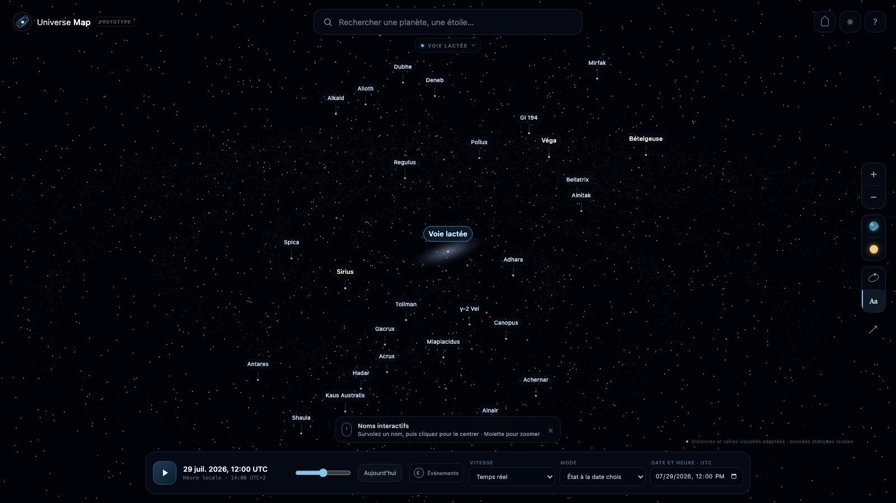

# Universe Map

[](https://github.com/Nayruuu/my-universe/actions/workflows/verify.yml)
[](https://angular.dev/)
[](https://threejs.org/)
[](LICENSE)

An interactive 3D map of the Universe — explore the Solar System, nearby stars, the Milky Way, and
the Local Group through time. Built with Angular and Three.js, with no backend.



Universe Map is a browser-only experiment at the intersection of a 3D map, a planetarium, and a
scientific visualization tool. Its long-term goal is to provide a continuous, Google Maps-like
journey across astronomical scales while clearly distinguishing measured, calculated, simulated,
and illustrative data.

> **Project status:** `v0.1.0` is a functional prototype. It prioritizes navigation, scale
> transitions, visual clarity, and scientific transparency over exhaustive astronomical coverage.

[Read the complete technical reference](docs/TECHNICAL_REFERENCE.md).

## Highlights

- Continuous semantic zoom from a planet to the Local Group, with a reversible camera journey that
  preserves its spatial anchor.
- The Sun, all eight planets, the Moon, orbital paths, axial rotation, atmospheres, and Saturn's
  rings.
- Locally calculated planetary and lunar ephemerides with an editable UTC timeline and multiple time
  speeds.
- A compact observed catalogue of 10,000 HYG v4.1 stars, rendered as one GPU batch.
- Procedural representations of the Milky Way, Andromeda, the Triangulum Galaxy, the Magellanic
  Clouds, and nearby dwarf galaxies.
- Searchable and clickable names, object details, confidence levels, and shareable URL state.
- Solar and lunar eclipse visualization, including local circumstances for selected French cities.
- Three adaptive graphics profiles, desktop and touch navigation, and a built-in debug panel.
- Static local datasets only: no account, application API, database, or backend service.

## Scientific transparency

Every astronomical object carries an explicit confidence level:

`observed` · `calculated` · `extrapolated` · `simulated` · `procedural` · `illustrative`

Scientific source units remain in the datasets and are converted by hierarchical coordinate frames.
Visual radii, inter-scale distances, brightness, and some morphologies are intentionally adapted when
physical scale would make the map unreadable. Those adaptations are identified in the interface.

The ephemeris model is suitable for educational visualization, not spacecraft navigation or
professional astronomical prediction.

## Getting started

Requirements: a current Node.js LTS release and npm.

```bash
git clone https://github.com/Nayruuu/my-universe.git
cd my-universe/client
npm ci
npm start
```

Open `http://localhost:4200`.

The root `Makefile` provides the same repository-level workflow as the Portfolio project:

```bash
make install
make dev
```

To use another port:

```bash
npm start -- --port 4203
```

## Controls

| Action                     | Desktop                                      | Touch                    |
| -------------------------- | -------------------------------------------- | ------------------------ |
| Orbit around a target      | Left-click and drag                          | One-finger drag          |
| Pan                        | Right-click and drag                         | Two-finger drag          |
| Zoom                       | Mouse wheel, semantic across scales          | Pinch                    |
| Select                     | Click an object                              | Tap                      |
| Focus                      | Click a name, double-click an object, or `F` | Tap a name or double-tap |
| Play or pause time         | `Space`                                      | Timeline button          |
| Change simulation speed    | `+` / `-`                                    | Timeline selector        |
| Close the information card | `Escape`                                     | Close button             |

The scale selector provides direct shortcuts to planetary, Solar System, stellar, galactic, and
Local Group views.

## Quality gates

The project uses strict TypeScript, ESLint, Angular template linting, Stylelint, Prettier, Vitest,
Playwright, and a production build check.

```bash
npm run verify
```

From the repository root, the equivalent command is `make verify`.

The current baseline contains:

- 442 unit and integration tests;
- 100% statements, branches, functions, and lines coverage across production code;
- individual 100% coverage gates for declared scientific modules;
- 25 end-to-end Chromium journeys across desktop and mobile viewports.

GitHub Actions runs the same verification on every push and pull request.

## Architecture

```text
.
├── client/              Self-contained Angular application
│   ├── src/
│   │   ├── app/         Angular UI, application state, search, URL and settings
│   │   ├── engine/      Framework-independent Three.js engine
│   │   └── data/        Strict models and runtime validation
│   ├── public/data/     Versioned static astronomical datasets
│   ├── e2e/             Desktop and mobile browser journeys
│   └── tools/           Coverage and catalogue preparation scripts
├── docs/                Technical reference and coding rules
├── .agents/             Tool-independent coding-agent roles
├── .github/             Repository automation
└── Makefile             Repository-level development commands
```

As in the Portfolio repository, project governance and documentation remain at the root while the
Angular runtime is isolated in `client/`. The engine has no dependency on Angular components. It
publishes typed events through a small facade, while the render loop runs outside Angular change
detection.

## Static deployment

```bash
npm run build
```

The deployable application is generated in `client/dist/universe-map/browser/` and can be hosted by
any static file server or CDN.

## Data provenance

- Planetary and lunar calculations use
  [Astronomy Engine](https://github.com/cosinekitty/astronomy), executed locally in the browser.
- The dense stellar field is derived from
  [HYG Database v4.1](https://github.com/astronexus/HYG-Database) under CC BY-SA 4.0.
- Local Group positions are based on McConnachie's catalogue of nearby galaxies.
- The Earth texture uses NASA Visible Earth Blue Marble imagery stored with the application.

See [client/data-sources/README.md](client/data-sources/README.md) and the in-app confidence labels
for detailed provenance and known visual adaptations.

## Roadmap

- Generalize semantic zoom and automatic reference-frame changes to every object and touch gesture.
- Add statically tiled star catalogues, progressive loading, caching, and worker-based processing.
- Extend spatial coverage beyond the Local Group.
- Add major moons, dwarf planets, asteroids, and comets.
- Implement the physically delayed **Observable view** temporal mode.
- Benchmark startup time, memory, and frame rate across a wider device panel.

## License

The application source code is available under the [MIT License](LICENSE). Bundled datasets and
third-party assets remain subject to their respective licenses and attribution requirements.
